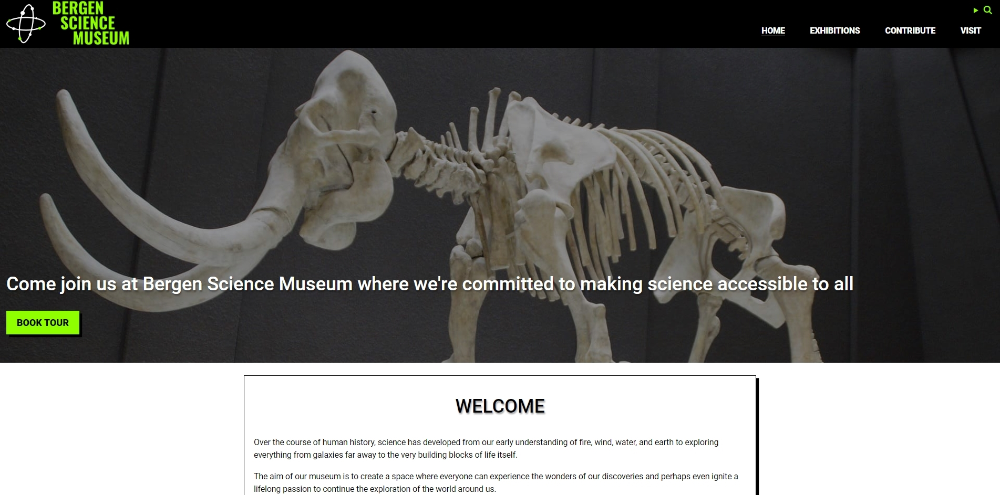

# Semester Project 1

## Description

In this project we were asked to design and build a modern, accessible and responsive web presence for a made up museum client. The text content and images were provided and we could come up with a name for the museum. We were also free to create a placeholder logo for the client. I chose to call my website "Bergen Science Museum".

The site is supposed to appeal to youngsters without pandering; while aiming at a younger audience it should not patronize them with overtly childish themes. The core purpose of the site is to excite and entice people to visit the museum.

We had to fulfill these user stories to complete the project:

- A visitor can view a home page showing key information and impactful imagery.
- A visitor can view a contact page showing the museum's address, phone number, opening hours and contact form.
- A visitor can view a contribution showing information on how to contribute to the museum.
- A visitor can view an exhibitions showing upcoming events and available exhibitions.
- A visitor can view a privacy policy page showing the museum's privacy policy.
- A visitor can view a terms and conditions page showing the museum's terms and conditions.

## Requirements

These were the requirements for the project:
Project images should be sized appropriately and optimized for web delivery.

- The project must be responsive on mobile, tablet and large screen devices.
- The project must be cross-browser compatible.
- The project must be accessible to a range of users including those with impairments or disabilities.
- The project must be built using semantic HTML elements.
- The project must adhere to the CSS DRY principle.
- The project must be well tested before delivery.
- The project design language must appeal to the target audience.

We had a few limitations for the project. JavaScript and CSS frameworks were not allowed.

## Built with

- HTML
- CSS

## Contact

[My LinkedIn page](https://www.linkedin.com/in/ina-elise-flom-b55433311/)
